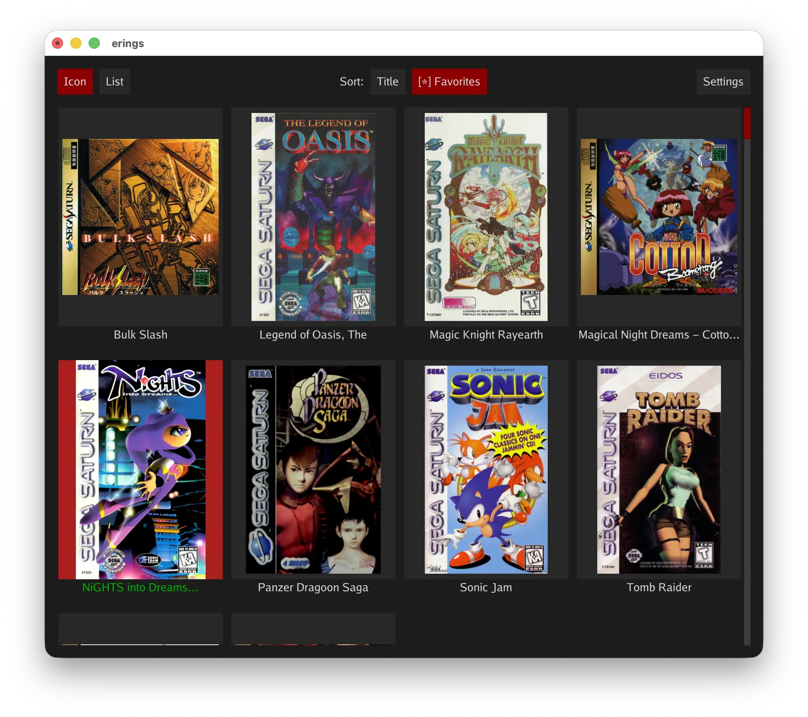
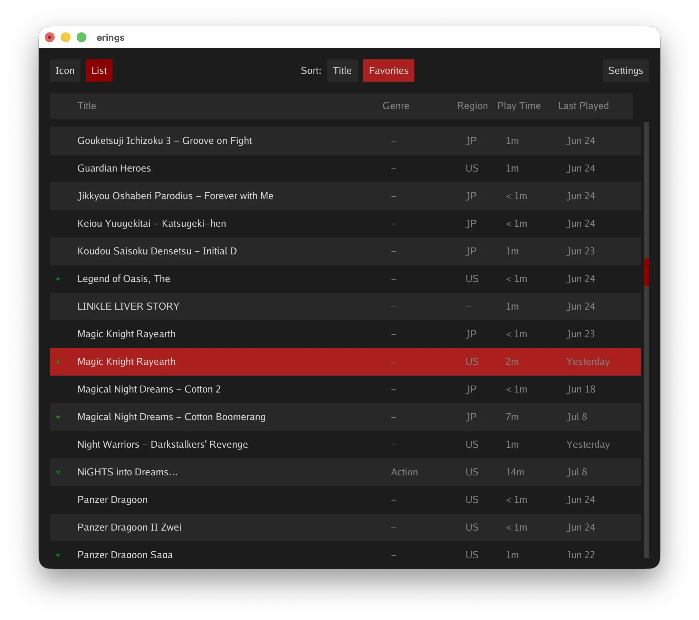
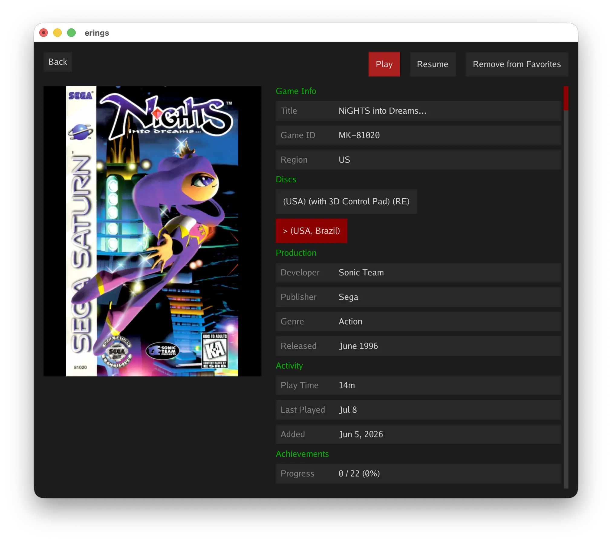
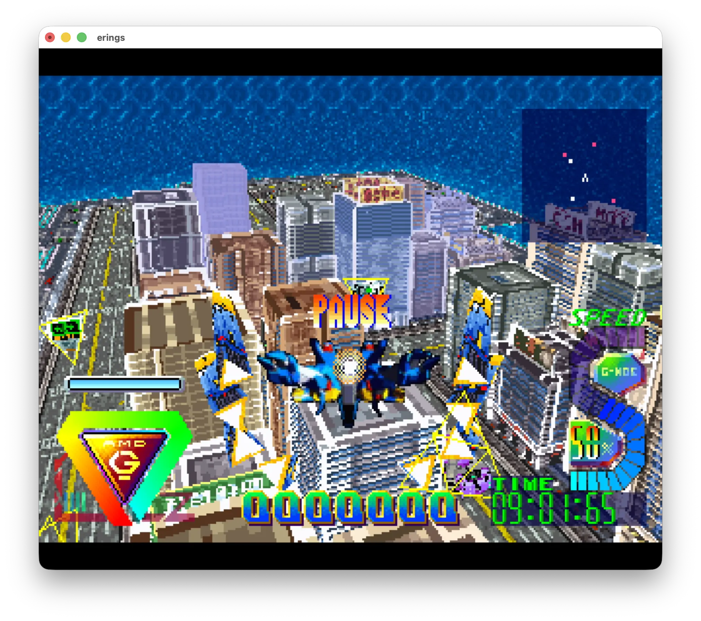
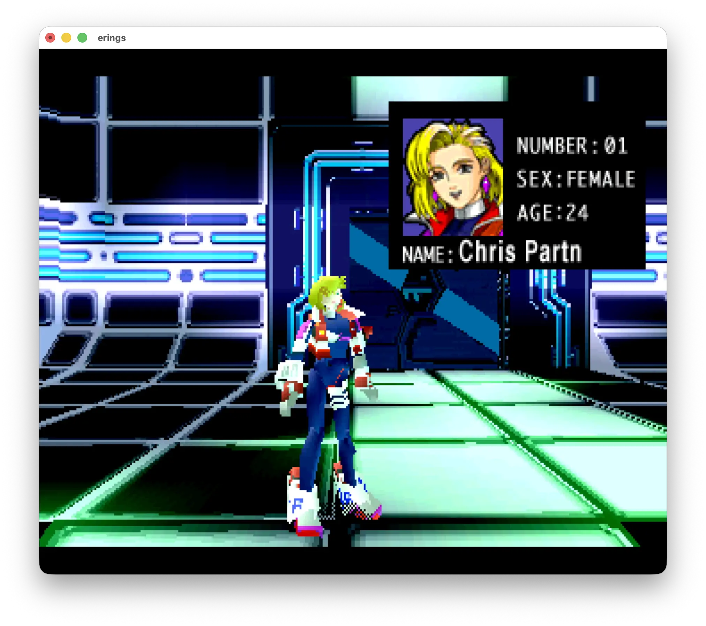
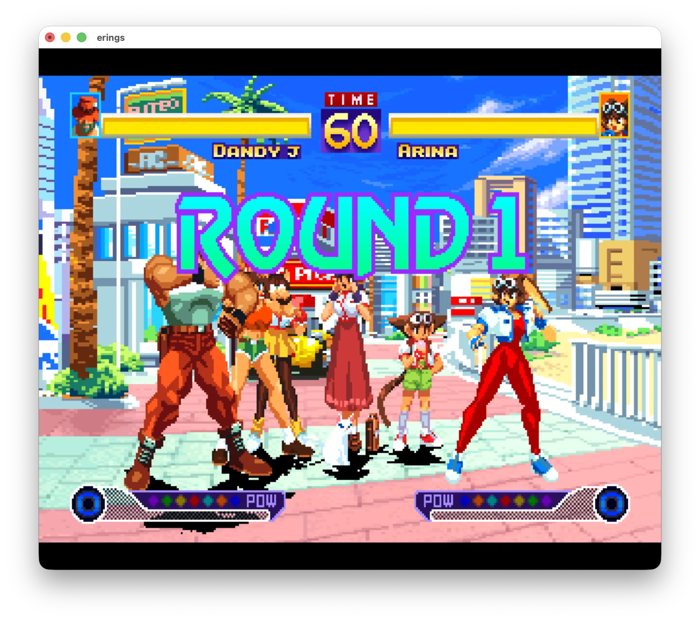

# erings

A Sega Saturn emulator.

erings is a work in progress. Pretty much all of the console's major internal
hardware components are implemented to some extent. Many games run and a number
of them at full speed. However, there are still plenty bugs to find.

The focus of erings is to play the majority of officially licensed games while
focusing on the user experience. This is not intended to be a perfect emulator
of every aspect of the Saturn. Some features and components are purposely not
supported and never will be. It might be better to think of this as
a Saturn game player than a digital Saturn console.

This is a gaming first emulator and not intended as game development tool.
You won't find an integrated debugger you can step through. You won't find
any kind of editor. The only development tools are intended for helping debug
the emulator itself.

What you will find is a clean UI allowing you organize and play games. With
a controller first navigation system. Make erings full screen, sit back and
have fun playing some amazing classic games.

## Screenshots

<table>
  <tr>
    <td align="center"> Library (icon)</td>
    <td align="center"> Library (list)</td>
    <td align="center"> Game details</td>
  </tr>
  <tr>
    <td align="center"> Bulk Slash</td>
    <td align="center"> Burning Rangers</td>
    <td align="center"> Waku Waku 7</td>
  </tr>
</table>

## Current State and Major Features

- Runs through the eblitui desktop UI
- RetroAchievements
- NTSC and PAL region
- A 4MB extended RAM cartridge
- Single player digital controller only (the core supports a second
  controller, but the UI does not)
- Internal backup RAM (console saves) persists between sessions
- Save states
- MPEG card

BIOS region patching is supported. Meaning you can use a US BIOS to play
Japanese games or a Japanese BIOS to play US games. Or just use the HLE BIOS
and not worry about it.

## Disc formats

Several disc image formats are supported

- chd
- cue (tracks must have .bin extension)

## BIOS

A Saturn BIOS image (USA or Japan) is optional. Without one, a built-in
HLE (high-level emulation) BIOS boots the game. A real BIOS is not
included with the emulator and needs to be user sourced.

## Building

Build the desktop binary with make: `make`. This provides a binary that
can be run locally on the command line. This produces a debug build.
Release builds are created when building OS packages.

### Packages

Proper OS specific packages can be built using make targets.

- `windows`
- `macos`
- `appimage`

All builds are put into the `./build` directory.

## UI Controls

Game controls (D-pad, buttons) are configured in the UI's input settings.

| Key | Action |
|-----|--------|
| Escape | Open / close the pause menu (also Select on a gamepad) |
| Tab | Toggle the achievement overlay |
| R (hold) | Rewind while held |
| F1 | Save state to the current slot |
| F2 | Next save state slot |
| Shift + F2 | Previous save state slot |
| F3 | Load state from the current slot |
| F4 | Cycle turbo speed (Off, 2x, 3x) |
| F11 | Toggle fullscreen |
| F12 | Screenshot |

## Won't be Supported

- ROM cartridges
- HDTV mode (TVM=100)
- 31 kHz exclusive monitor mode
- Peripherals (light gun, mouse, racing wheel, keyboard, etc.)

## Planned

- Disc swapping for multi-disc games
  - Right now you have to rely on the game saving, exiting the game
    and selecting the next game from the ui
- GPU compute shaders
  - Internal resolution upscaling
  - Other graphical enhancements
- Possible performance enhancements
- Bug fixes
- Better game compatibility

## Game Compatibility

Compatibility is not formally tracked yet. Some games play, some
don't. Some play well, some don't.
